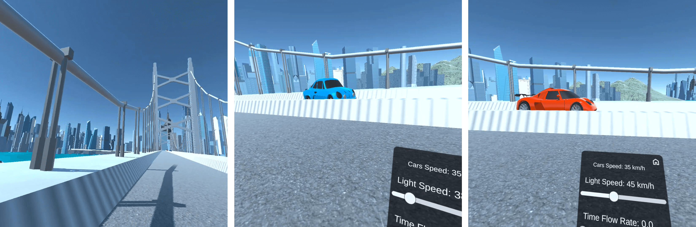

# VirtualRelativity

Interactive simulator of the **Special Theory of Relativity** in Virtual Reality.


## 📣 About

**VirtualRelativity** is a Unity solution based on the development of a virtual reality simulation of the effects of special relativity in interactable environment.

This repository contain both the source code of the package and the final application that transports users in experiencing relativistic effects in real-life scenarios.

The primary focus of this project lies in the accurate representation of relativistic laws, as well as in the modeling of a user interface specifically crafted to enhance understanding and interactivity.

## 🕹️ Usage

The only requirement is the last version of the [Unity Game Engine](https://unity.com/). You can then use VirtualRelativity by cloning the repository locally:

```bash
git clone https://github.com/albertoboffi/virtual-relativity.git
```

## 💡 Implemented Effects

VirtualRelativity currently implement the following relativistic effects:
* Length contraction
* Time dilation
* Relativistic Doppler effect
* ... Relativity of simultaneity (**Coming Soon** 😉)

## 🤝 Contributors

* [Alberto Boffi](https://github.com/albertoboffi)
* Prof. Ezio Puppin
* Maurizio Contran

## 👏 Credits

* Game Engine: [Unity](https://unity.com/)
* 3D Models: [CGTrader](https://www.cgtrader.com/), [Unity Assets Store](https://assetstore.unity.com/)
* TTS: [Narakeet](https://www.narakeet.com/)

##  🎬 Project Highlights

[<p align="center"><a href="https://vimeo.com/927037750"></a></p>](https://vimeo.com/927037750)

### 📸 Screenshots




